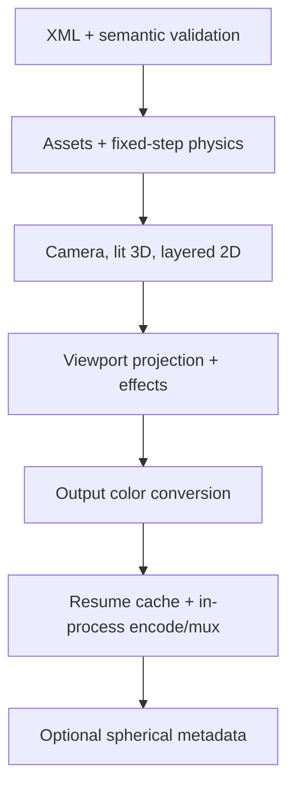

# Architecture

## Design constraints

The application is C17 with a narrow POSIX platform layer. There is no global
mutable engine state: scenes, diagnostics, render options, frames, caches, and
encoders have explicit owners and lifetimes. Dynamically sized arrays impose no
artificial layer limit. Production codecs and text shaping remain in mature
external components rather than being reimplemented, all linked in-process:
codecs are the FFmpeg libraries; text uses Fontconfig, FriBidi, HarfBuzz and
FreeType. The engine starts no child processes.

## Modules

| Module | Responsibility |
|---|---|
| `common`, `diagnostics` | checked allocation/parsing/path helpers and contextual messages |
| `scene` | owned scene graph and typed resources |
| `xml*` | Expat callbacks, dynamic element stack, typed attributes, semantic/reference validation |
| `timeline` | stable key ordering and six interpolation curves |
| `assets`, `procedural` | shared still/text/vector cache; video assets own a persistent decoder |
| `text` | Fontconfig family lookup, per-scene font cache, FriBidi (UAX #9) paragraph levels and per-line run reordering, HarfBuzz shaping per bidi/script run, line breaking and alignment in the asset box, FreeType rasterization to coverage |
| `video` | in-process libav image decode and per-asset video decoder with keyframe seeking and a byte-bounded frame LRU |
| `vector_path`, `mesh` | exact-area SVG-style path fill/stroke coverage and Wavefront OBJ loading |
| `parallel`, `color` | deterministic row jobs; 8-bit input to blend space and blend space to 8- or 16-bit output conversion |
| `raster` | premultiplied W3C blend kernel and signed-distance anti-aliased coverage |
| `audio` | in-memory libav/swresample decode per asset and sample-exact block mixer |
| `physics` | fixed-step 2D solver, contacts, constraints, and atomic cache serialization |
| `lighting` | CPU primitive/triangle rasterization, depth, material lighting, approximate shadows |
| `compositor` | hierarchy, isolated group buffers, masks, deformation, sampling, and particles |
| `camera` | equirectangular viewport mapping and deterministic row workers |
| `effects` | parallel blur, glow/bloom, grade, vignette, and lens-flare approximation |
| `gpu` | optional OpenCL 1.2 final color-conversion kernel and capability probe |
| `resume` | content-signature directory and atomic raw-frame cache writes |
| `encoder` | in-process libavcodec/libavformat encode: swscale RGB to Y'CbCr, A/V muxing, color tags, spherical side data |
| `spatial` | atomic MP4 Spatial Media v1 spherical UUID injection (moov before or after mdat) |
| `renderer` | phase ordering, absolute-frame loop, preview/range/resume, and metrics |
| `main` | CLI parsing, overrides, quality policy, and documented fallbacks |

## Ownership and streaming

- `sr_scene_load_xml` owns every allocation reachable from `SrScene`;
  `sr_scene_free` releases it.
- Layer instances reference shared assets. A still/text/vector asset holds one
  cached blend-space image. A video asset owns one open demuxer/decoder and
  an LRU of converted frames keyed by source-frame index (256 MiB per asset,
  at least two frames), each converted to blend space once when decoded;
  request/hit/decode/seek counts are reported by `--metrics`.
- Text assets are rendered once while assets load. Fonts are opened through a
  per-scene cache keyed by (resolved path, face index) and owned by `SrScene`
  (freed by `sr_assets_unload`/`sr_scene_free`); each font owns its FreeType
  library and HarfBuzz face, so fonts share no mutable state. Layout uses
  unhinted HarfBuzz positions (26.6); glyph origins are quantized to 1/4 px
  and rendered as unhinted 8-bit anti-aliased FreeType outlines, accumulated
  with a saturating add into a float coverage buffer, then multiplied by the
  premultiplied blend-space text color. Output depends only on the inputs
  and the library versions.
- A mesh asset owns one parsed vertex/normal/triangle set reused by every mesh
  object instance.
- Each audio asset is decoded once, in memory, to the mix format and shared by
  its tracks. The mixer writes one block per video frame straight into the
  encoder; there are no temporary files.
- The renderer keeps current working/output surfaces, not the entire movie.
  Frames are float premultiplied RGBA (16 bytes per pixel): a 3840x2160
  frame is 126.6 MiB. The compositor keeps one isolated-group buffer per
  nesting depth, allocated lazily on first use and reused for every later
  group and frame (no per-frame allocation); only the dirty rectangle (union
  of the children's clipped bounds) of a buffer is cleared or composited. A
  4K scene with one level of isolated groups therefore holds two float
  frames plus the 8-bit output buffer (31.6 MiB; 63.3 MiB at 16 bits for
  pixel formats deeper than 8 bits) handed to the encoder, resume cache, and
  PPM/PNG preview.
- Each worker receives disjoint rows. No floating-point reduction depends on
  scheduling, so CPU output is byte-identical across supported thread counts.

## Frame execution

At absolute frame `N`, master time is calculated from the integer frame index
and rational FPS. Audio sample zero and video frame zero both represent the
selected range start, so the encoder receives synchronized, zero-based
streams; frame `N`'s audio block is samples
`[floor(N·rate·fps_den/fps_num), floor((N+1)·rate·fps_den/fps_num))`,
computed in exact integer arithmetic. A layer without `source.time` maps local time through speed,
time-stretch, trim, finite loop count, and reverse; an explicit `source.time`
animation takes precedence.

## Color and compositing

All compositing happens in the *blend space*: the project working gamut,
linear light when `linearLight="true"`, otherwise the working space's
transfer-encoded values, stored as float premultiplied RGBA. Decoded 8-bit
image/video/vector pixels are converted once (per cached video frame)
through a 256-entry transfer-decode table, the source-to-working gamut
matrix, a re-encode when not linear, and premultiplication. XML colors
(including text colors, which multiply the float glyph coverage directly) are
working-space values and are converted the same way.

Blending uses the W3C Compositing Level 1 separable formula on premultiplied
values for normal, add, multiply, screen, overlay, and difference;
colors are unpremultiplied only to evaluate the blend function, `add` is not
clamped, and opacity and mask coverage scale the premultiplied source. The
final frame is unpremultiplied, linearized, mapped to the output gamut,
transfer-encoded through a 65536-entry table, clamped, and rounded half up to
8-bit straight RGBA (or 16-bit, scaled to 0..65535, when the output pixel
format is deeper than 8 bits), in parallel rows; the OpenCL kernel performs
the same 8-bit conversion when selected. libswscale converts to Y'CbCr with an
explicit BT.709/BT.2020 matrix and range, and the stream carries matching
primaries, transfer, matrix, and range tags.

Groups with a non-normal blend or opacity below one render into an isolated
buffer composited once with their blend, opacity, and masks; other groups
pass their children through to the parent target, and their masks join the
mask chain whose coverage multiplies into every child draw. Rect, ellipse, and
rounded-rect shapes and masks get anti-aliased coverage from a signed
distance divided by the local pixel footprint (`sqrt(|det|)` of the inverse
world transform); strokes are centred on the outline. A node's masks
multiply, each evaluated in the node's inverse world transform, so nested and
inverted masks remain stable under parent transformations. Images are
sampled bilinearly on premultiplied texels at pixel centres, clamped to the
edge texels, and multiplied by the geometric coverage of the image rectangle
(signed distance at the pixel footprint), so edges fade over about one output
pixel at any magnification. Deformation is an inverse
sample warp, avoiding holes in the destination. Every draw is split into
disjoint row ranges, so results are identical for any thread count.

## 3D, lighting, and physical behavior

Built-in spheres, boxes, planes, and OBJ triangles share a per-frame depth
buffer. Perspective/orthographic cameras and ambient, directional, point, and
spot lights feed deterministic CPU material shading. `castShadow` and
`receiveShadow` use screen-space and bounding-volume occlusion approximations.
They are useful visual behavior, not a claim of a physically based renderer.

Physics samples at the XML `fixedStep`, independently of output FPS. Dynamic
bodies receive gravity, force fields, springs, damping, contact iterations,
friction, and restitution. Render poses interpolate adjacent fixed samples.
The optional cache contains an engine/versioned scene signature (including
geometry, forces, and constraints) and is committed by atomic rename. Soft
bodies and bend/twist/wave/squash/stretch modifiers are deterministic visual
approximations, not verified physically accurate simulation.

## 360 and metadata

Equirectangular longitude wraps in X and latitude clamps in Y. Viewport rays
use vertical FOV and output aspect, then apply roll, pitch, and yaw before
bilinear panorama sampling. Translation is intentionally irrelevant to an
infinitely distant panorama. Successful MP4/MOV equirectangular renders can be
post-processed with the Google Spatial Media v1 spherical UUID; the muxer also
writes MP4 `sv3d`/`st3d` and the Matroska `Projection` element from
equirectangular spherical side data.

## CPU/GPU, resume, and failures

CPU rasterization is the deterministic reference. `--renderer gpu` probes a
real OpenCL GPU, compiles a kernel, and can offload final gamut/transfer
conversion. Rasterization, masking, lighting, and effects remain on the CPU.
If the OpenCL loader/device/kernel is unavailable, the engine logs a warning
and uses the CPU path without changing scene semantics.

Resume mode atomically stores completed RGBA output frames under
`OUTPUT.resume/SIGNATURE`. Restarting still rebuilds the output container but
skips cached frame rendering. Cached frames are stored at the bit depth the
encoder consumes, which is part of the signature. Missing assets, codecs,
OpenCL, memory, cache writes, and libav failures produce contextual diagnostics
and a nonzero exit instead of partial success.
