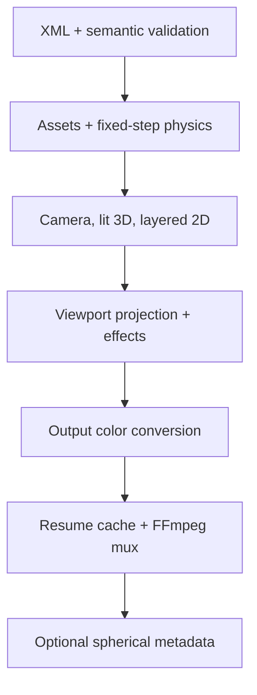

# Architecture

## Design constraints

The application is C17 with a narrow POSIX platform layer. There is no global
mutable engine state: scenes, diagnostics, render options, frames, caches, and
encoders have explicit owners and lifetimes. Dynamically sized arrays impose no
artificial layer limit. Production codecs and shaped-text rasterization remain
in mature external components rather than being reimplemented.

## Modules

| Module | Responsibility |
|---|---|
| `common`, `diagnostics` | checked allocation/parsing/path helpers and contextual messages |
| `scene` | owned scene graph and typed resources |
| `xml*` | Expat callbacks, dynamic element stack, typed attributes, semantic/reference validation |
| `timeline` | stable key ordering and six interpolation curves |
| `assets`, `procedural` | shared still/text/vector cache and lazy video-frame LRU |
| `vector_path`, `mesh` | SVG-style filled paths and Wavefront OBJ loading |
| `parallel`, `color` | deterministic row jobs and sRGB/Display-P3/Rec.2020 conversion |
| `audio` | FFmpeg decode to disk streams and bounded C mixer |
| `physics` | fixed-step 2D solver, contacts, constraints, and atomic cache serialization |
| `lighting` | CPU primitive/triangle rasterization, depth, material lighting, approximate shadows |
| `compositor` | hierarchy, nested masks, deformation, sampling, blends, and particles |
| `camera` | equirectangular viewport mapping and deterministic row workers |
| `effects` | parallel blur, glow/bloom, grade, vignette, and lens-flare approximation |
| `gpu` | optional OpenCL 1.2 final color-conversion kernel and capability probe |
| `resume` | content-signature directory and atomic raw-frame cache writes |
| `encoder` | FFmpeg encoder preflight, supervised pipe, A/V muxing, and color tags |
| `spatial` | atomic MP4 Spatial Media v1 spherical UUID injection |
| `renderer` | phase ordering, absolute-frame loop, preview/range/resume, and metrics |
| `main` | CLI parsing, overrides, quality policy, and documented fallbacks |

## Ownership and streaming

- `sr_scene_load_xml` owns every allocation reachable from `SrScene`;
  `sr_scene_free` releases it.
- Layer instances reference shared assets. A still/text/vector asset holds one
  cached RGBA image; a video has four LRU entries keyed by source-frame index.
- A mesh asset owns one parsed vertex/normal/triangle set reused by every mesh
  object instance.
- Decoded and mixed audio use temporary disk streams, mixed in 4096-frame
  blocks. Cleanup covers normal and error exits.
- The renderer keeps current working/output surfaces, not the entire movie.
- Each worker receives disjoint rows. No floating-point reduction depends on
  scheduling, so CPU output is byte-identical across supported thread counts.

## Frame execution

At absolute frame `N`, master time is calculated from the integer frame index
and rational FPS. Audio sample zero and video frame zero both represent the
selected range start. FFmpeg therefore receives synchronized, zero-based
streams. A layer without `source.time` maps local time through speed,
time-stretch, trim, finite loop count, and reverse; an explicit `source.time`
animation takes precedence.

## Color and compositing

Decoded image/video assets are converted from their declared sRGB, Rec.709,
Display-P3, or Rec.2020 source space into the selected working space. Straight-alpha
source-over implements normal, add, multiply, screen, overlay, and difference.
With `linearLight="true"`, blend operands are transfer-decoded and encoded in
the working gamut. The final frame is converted to the output color space and
FFmpeg receives matching primaries, transfer, matrix, and range flags.

Group and drawable masks are evaluated in their inverse world transforms.
Rectangular, elliptical, rounded-rect, inverted, and nested masks therefore
remain stable under parent transformations. Deformation is an inverse sample
warp, avoiding holes in the destination.

## 3D, lighting, and physical behavior

Built-in spheres, boxes, planes, and OBJ triangles share a per-frame depth
buffer. Perspective/orthographic cameras and ambient, directional, point, and
spot lights feed deterministic CPU material shading. `castShadow` and
`receiveShadow` use screen-space and bounding-volume occlusion approximations.
They are useful visual behavior, not a claim of a physically based renderer.

Physics samples at the XML `fixedStep`, independently of output FPS. Dynamic
bodies receive gravity, force fields, springs, damping, contact iterations,
friction, and restitution. Render poses interpolate adjacent fixed samples.
The optional cache contains an engine/versioned scene signature (including
geometry, forces, and constraints) and is committed by atomic rename. Soft
bodies and bend/twist/wave/squash/stretch modifiers are deterministic visual
approximations, not verified physically accurate simulation.

## 360 and metadata

Equirectangular longitude wraps in X and latitude clamps in Y. Viewport rays
use vertical FOV and output aspect, then apply roll, pitch, and yaw before
bilinear panorama sampling. Translation is intentionally irrelevant to an
infinitely distant panorama. Successful MP4/MOV equirectangular renders can be
post-processed with the Google Spatial Media v1 spherical UUID; Matroska keeps
FFmpeg projection tags.

## CPU/GPU, resume, and failures

CPU rasterization is the deterministic reference. `--renderer gpu` probes a
real OpenCL GPU, compiles a kernel, and can offload final gamut/transfer
conversion. Rasterization, masking, lighting, and effects remain on the CPU.
If the OpenCL loader/device/kernel is unavailable, the engine logs a warning
and uses the CPU path without changing scene semantics.

Resume mode atomically stores completed RGBA output frames under
`OUTPUT.resume/SIGNATURE`. Restarting still rebuilds the output container but
skips cached frame rendering. Missing assets, codecs, FFmpeg/OpenCL, memory,
cache writes, pipes, and child-process failures produce contextual diagnostics
and a nonzero exit instead of partial success.
