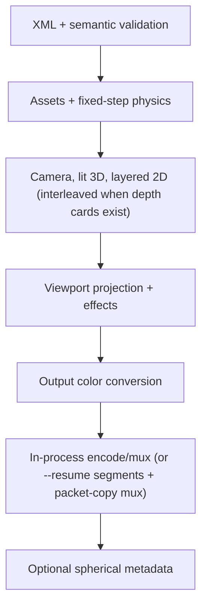

# Architecture

## Design constraints

The application is C17 with a narrow POSIX platform layer. There is no global
mutable engine state: scenes, diagnostics, render options, frames, caches, and
encoders have explicit owners and lifetimes. Dynamically sized arrays impose no
artificial layer limit. Production codecs and text shaping remain in mature
external components rather than being reimplemented, all linked in-process:
codecs are the FFmpeg libraries; text uses Fontconfig, FriBidi, HarfBuzz and
FreeType. The engine starts no child processes.

## Modules

| Module | Responsibility |
|---|---|
| `common`, `diagnostics` | checked allocation/parsing/path helpers and contextual messages |
| `scene` | owned scene graph and typed resources |
| `xml_schema` | libxml2 (≥ 2.9.14) validation, from the loader's in-memory buffer with a refusing external entity loader, against the XSD embedded at build time (`cmake/schema_data.c.in` or the Makefile's od/sed recipe) |
| `xml*` | Expat callbacks, dynamic element stack, typed attributes, semantic/reference validation |
| `timeline` | stable key ordering and six interpolation curves |
| `assets`, `procedural` | shared still/text/vector cache; video assets own a persistent decoder |
| `text` | Fontconfig family lookup, per-scene font cache, FriBidi (UAX #9) paragraph levels and per-line run reordering, HarfBuzz shaping per bidi/script run, line breaking and alignment in the asset box, FreeType rasterization to coverage |
| `video` | in-process libav image decode and per-asset video decoder with keyframe seeking and a byte-bounded frame LRU |
| `vector_path`, `mesh` | exact-area SVG-style path fill/stroke coverage and Wavefront OBJ loading |
| `parallel`, `color` | deterministic row jobs; 8-bit input to blend space and blend space to 8- or 16-bit output conversion |
| `raster` | premultiplied W3C blend kernel and signed-distance anti-aliased coverage |
| `audio` | in-memory libav/swresample decode per asset and sample-exact block mixer |
| `physics` | fixed-step 2D solver (OBB/circle contacts, springs, pins, fields), mass-spring soft bodies, and atomic cache serialization |
| `lighting` | CPU primitive/triangle rasterization, depth, material lighting, shadow maps, 3D supersampling; whole-pass or per-object drawing |
| `card` | depth-card camera view, plane pose and homography, per-sample plane depth, depth-of-field radius |
| `compositor` | hierarchy, isolated group buffers, group effects, masks, deformation, sampling, particle drawing, depth-card projection, run sorting, and 3D interleaving |
| `particles` | closed-form, stateless parametric particle evaluation |
| `deform` | bilinear control-grid inverse warp shared by mesh-warp and soft bodies |
| `camera` | equirectangular viewport mapping and deterministic row workers |
| `effects` | rectangle-bounded blur, glow/bloom, grade, vignette, lens flare, drop shadow, and 2D lighting on the frame or a group buffer |
| `gpu` | optional OpenCL 1.2 final color-conversion kernel and capability probe |
| `resume` | `OUTPUT.parts/` segment directory: manifest fingerprint, discard on mismatch, atomic segment commit, cleanup |
| `encoder` | in-process libavcodec/libavformat encode: swscale RGB to Y'CbCr, A/V muxing, color tags, spherical side data; video-only segment mode and packet-copy (pass-through) mode for resume assembly |
| `spatial` | atomic MP4 Spatial Media v1 spherical UUID injection (moov before or after mdat) |
| `renderer` | phase ordering, absolute-frame loop, preview/range/hash/segmented resume, and metrics |
| `cli_args` | pure argv → `SrCliOptions` parsing and usage text (no I/O, no exit), unit-tested |
| `main` | orchestration: overrides, quality policy, printing, exit status |

## Ownership and streaming

- `sr_scene_load_xml` owns every allocation reachable from `SrScene`;
  `sr_scene_free` releases it.
- Layer instances reference shared assets. A still/text/vector asset holds one
  cached blend-space image. A video asset owns one open demuxer/decoder and
  an LRU of converted frames keyed by source-frame index (256 MiB per asset),
  each converted to blend space once when decoded; request/hit/decode/seek
  counts are reported by `--metrics`. The budget always yields to one frame
  (the one just returned): a single frame larger than the budget is kept
  regardless (7680×4320 float RGBA is about 506 MiB), and asset loading
  warns once when the frames all sources keep together exceed the budget.
  Frame `i` shows the latest source frame presented at or before `i / fps`
  on the file's timeline, whose origin (the container start, audio codec
  priming excluded) the asset's soundtrack shares.
- Text assets are rendered once while assets load. Fonts are opened through a
  per-scene cache keyed by (resolved path, face index) and owned by `SrScene`
  (freed by `sr_assets_unload`/`sr_scene_free`); each font owns its FreeType
  library and HarfBuzz face, so fonts share no mutable state. Layout uses
  unhinted HarfBuzz positions (26.6); glyph origins are quantized to 1/4 px
  and rendered as unhinted 8-bit anti-aliased FreeType outlines, accumulated
  with a saturating add into a float coverage buffer, then multiplied by the
  premultiplied blend-space text color. Output depends only on the inputs
  and the library versions.
- A mesh asset owns one parsed vertex/normal/triangle set reused by every mesh
  object instance.
- Each audio asset is decoded once, in memory, to the mix format and shared by
  its tracks. The mixer writes one block per video frame straight into the
  encoder; there are no temporary files.
- The renderer keeps current working/output surfaces, not the entire movie.
  Frames are float premultiplied RGBA (16 bytes per pixel): a 3840x2160
  frame is 126.6 MiB. The compositor keeps one isolated-group buffer per
  nesting depth, allocated lazily on first use and reused for every later
  group and frame (no per-frame allocation); only the dirty rectangle (union
  of the children's clipped bounds) of a buffer is cleared or composited. A
  4K scene with one level of isolated groups therefore holds two float
  frames plus the 8-bit output buffer (31.6 MiB; 63.3 MiB at 16 bits for
  pixel formats deeper than 8 bits) handed to the encoder, `--hash`, and
  PPM/PNG preview.
- Each worker receives disjoint rows. No floating-point reduction depends on
  scheduling, so CPU output is byte-identical across supported thread counts.
- The 3D pass clips mesh triangles against the camera's near/far planes
  before projection and uses perspective-correct depth and attributes.
  Opaque surfaces fill the depth buffer. Translucent samples are stored
  until the batch is complete, tested against the final opaque depth,
  and blended far to near per pixel;
  their temporary memory grows with translucent coverage and overdraw,
  including supersamples. Fully transparent surfaces write no depth.

## Frame execution

At absolute frame `N`, master time is calculated from the integer frame index
and rational FPS. Audio sample zero and video frame zero both represent the
selected range start, so the encoder receives synchronized, zero-based
streams; frame `N`'s audio block is samples
`[floor(N·rate·fps_den/fps_num), floor((N+1)·rate·fps_den/fps_num))`,
computed in exact integer arithmetic. A layer without `source.time` maps local time through speed,
time-stretch, trim, finite loop count, and reverse; an explicit `source.time`
animation takes precedence.

Implicit video trims are half-open: reverse playback starts on the frame
immediately before `clipOut`, and a completed forward clip holds that same
last included frame. Boundary tolerance is applied in source-frame units
on the appropriate side of the boundary.

## Color and compositing

All compositing happens in the *blend space*: the project working gamut,
linear light when `linearLight="true"`, otherwise the working space's
transfer-encoded values, stored as float premultiplied RGBA. Decoded 8-bit
image/video/vector pixels are converted once (per cached video frame)
through a 256-entry transfer-decode table, the source-to-working gamut
matrix, a re-encode when not linear, and premultiplication. XML colors
(including text colors, which multiply the float glyph coverage directly) are
working-space values and are converted the same way.

Blending uses the W3C Compositing Level 1 separable formula on premultiplied
values for normal, add, multiply, screen, overlay, and difference;
colors are unpremultiplied only to evaluate the blend function, `add` is not
clamped, and opacity and mask coverage scale the premultiplied source. The
final frame is unpremultiplied, linearized, mapped to the output gamut,
transfer-encoded through a 65536-entry table, clamped, and rounded half up to
8-bit straight RGBA (or 16-bit, scaled to 0..65535, when the output pixel
format is deeper than 8 bits), in parallel rows; the OpenCL kernel performs
the same 8-bit conversion when selected. libswscale converts to Y'CbCr with an
explicit BT.709/BT.2020 matrix and range, and the stream carries matching
primaries, transfer, matrix, and range tags.

Groups with a non-normal blend, opacity below one, or group `effects` render
into an isolated buffer composited once with their blend, opacity, and masks.
Group effects run on that buffer first, in the listed order; each one grows
the buffer's dirty rectangle by its reach (blur radius, shadow offset plus
radius) and processes only the grown rectangle, which gives the same pixels
as processing the whole buffer because everything outside it is transparent
and stays so. Effects no group references run on the whole final frame as
before. Other groups
pass their children through to the parent target, and their masks join the
mask chain whose coverage multiplies into every child draw. Rect, ellipse, and
rounded-rect shapes and masks get anti-aliased coverage from a signed
distance divided by the local pixel footprint (`sqrt(|det|)` of the inverse
world transform); strokes are centred on the outline. A node's masks
multiply, each evaluated in the node's inverse world transform, so nested and
inverted masks remain stable under parent transformations. Images are
sampled bilinearly on premultiplied texels at pixel centres, clamped to the
edge texels, and multiplied by the geometric coverage of the image rectangle
(signed distance at the pixel footprint), so edges fade over about one output
pixel at any magnification. Deformation is an inverse
sample warp, avoiding holes in the destination: mesh-warp and soft bodies
evaluate a bilinear displacement field over a control grid once per draw and
invert it per pixel by Newton iteration (an all-zero grid returns the input
point exactly, so a rest grid is bit-identical to no deformer); their draw
bounds grow by the largest offset. Every draw is split into
disjoint row ranges, so results are identical for any thread count.

Animated colors keep one keyframe track per channel with shared key times
and curves; red, green, and blue keys are stored decoded to linear light
(with the working space's transfer), interpolated, and re-encoded, so a
midpoint is the linear-light midpoint. Particles are evaluated in closed form
per particle index from the emitter seed (its `seed`, else project seed XOR
a hash of its id): birth time from the constant rate, or from a fixed
1/240 s integration grid of an animated rate; emission parameters sampled at
birth. Nothing depends on previously rendered frames or on thread count, and
the particles themselves are drawn in birth order on one thread.

## 3D, lighting, and physical behavior

Built-in spheres, boxes, planes, and OBJ triangles share a per-frame depth
buffer. Perspective/orthographic cameras and ambient, directional, point, and
spot lights feed deterministic CPU material shading. Directional and spot
lights with `castShadow` render a depth map per frame from the light
(orthographic, fitted to the bounding sphere of all objects, for directional
lights; perspective over the cone for spot lights) by casting one ray per
texel against every caster (analytic ellipsoid for spheres, the drawn
camera-facing quad for boxes and planes, triangles for meshes). Receivers
look it up at a consistent world point with 3x3 percentage-closer filtering
and a slope-scaled bias. Point lights keep the bounding-volume occlusion test
and the screen-space blob. `project antialias3d` N renders the pass into an
N x N supersampled buffer (depth per sample) and box-filters it over the
frame; N = 1 draws directly at pixel centers. These
are useful visual behavior, not a claim of a physically based renderer.
Under a camera, a sprite's depth is its camera-facing surface (the center's
view depth minus the sphere bulge) and mesh depth interpolates 1/z, so
intersecting objects occlude correctly.

Scenes with depth cards (see the XML reference) render the 3D pass and the
scene graph through `sr_compositor_render_scene`, which owns a per-sample
view-depth buffer shared by both. The 3D pass is split into begin / draw
object / flush: with cards directly under the composition, objects are
placed far to near among the first run of cards. Consecutive objects form
one batch; its translucent samples blend and its supersampled buffer
resolves before the next card. Without root cards, all objects share one
batch. A card renders into its pooled isolated buffer, either with an
exact affine world matrix or through a quantized plane buffer (its own pool,
so sizes do not churn the group pool) and a perspective warp; its composite
tests each depth sample against the buffer and writes where opaque. Depth
rows of a pixel row belong to that row, so row-parallel composites stay
deterministic across thread counts. Scenes without cards render the 3D pass
before layered 2D; depth cards retain their documented run ordering and
per-sample depth-write rules.

Physics samples at the XML `fixedStep`, independently of output FPS. Dynamic
bodies receive gravity, force fields (directional, radial, vortex; fields
evaluated at each step's time), springs, damping, contact iterations,
friction, and restitution; rigid pins are projected after contacts. Circles
use exact circle-vs-oriented-box contact and boxes a separating-axis test on
oriented boxes (identical to the former overlap test for unrotated boxes).
Soft bodies are rows x cols point-mass grids with structural and shear
springs, area-preserving pressure, optional pins, anchor springs to the
node's rigid pose when it also has a rigid body, and frame-bound collisions,
integrated with enough substeps per fixed step to stay stable; each sample
stores the grid's local offsets. Render poses and grids interpolate adjacent
fixed samples. The optional cache (format version 3) contains an
engine/versioned scene signature (including geometry, forces, animated field
tracks, constraints, and soft bodies) and is committed by atomic rename.
Bend/twist/wave/squash/stretch modifiers are deterministic visual effects,
and neither they nor the solver claim physical accuracy.

## 360 and metadata

Equirectangular longitude wraps in X and latitude clamps in Y. Viewport rays
use vertical FOV and output aspect, then apply roll, pitch, and yaw before
bilinear panorama sampling. Translation is intentionally irrelevant to an
infinitely distant panorama. Successful MP4/MOV equirectangular renders can be
post-processed with the Google Spatial Media v1 spherical UUID; the muxer also
writes MP4 `sv3d`/`st3d` and the Matroska `Projection` element from
equirectangular spherical side data.

## CPU/GPU, resume, and failures

CPU rasterization is the deterministic reference. `--renderer gpu` probes a
real OpenCL GPU, compiles a kernel, and can offload final gamut/transfer
conversion. Rasterization, masking, lighting, and effects remain on the CPU.
If the OpenCL loader/device/kernel is unavailable, the engine logs a warning
and uses the CPU path without changing scene semantics.

`--resume` splits the range into segments of `--segment-frames` frames
(default 150). Segment `k` is encoded by its own video-only encoder (no
audio, no spherical metadata) to a unique temporary file
`OUTPUT.parts/seg-KKKKKK.part.<pid>.<n>.<ext>` (mkv for FFV1, mp4
otherwise), created with `O_CREAT|O_EXCL|O_NOFOLLOW`, fsynced and committed
by `renameat` to `seg-KKKKKK.<ext>` with the directory fsynced after, so only
complete segments carry the final name; stale `.part.*` and `manifest.tmp*`
files are deleted on the next run. `OUTPUT.parts` must be a real directory
owned by the current user; after `lstat` it is opened with `O_NOFOLLOW` and
every later access goes through that descriptor (`openat`, `fstatat`,
`renameat`, `unlinkat`), never following a link inside, and cleanup unlinks
only names matching the segment/manifest/lock patterns. An exclusive
`flock` on `OUTPUT.parts/lock` is held for the whole run; a second run
fails with exit 7. `OUTPUT.parts/manifest` (at most 1 MiB; larger is stale)
is a text fingerprint: engine version, FNV-1a hash of the scene bytes the
loader parsed (`SrScene.source_hash`: the file is read once, both parsers
and the hash use the same buffer), size + mtime + full-content hash of
every asset, `fontFile` and family-resolved font file
(`sr_font_cache_path`), frame range, segment size, the effective project
and video output settings (after CLI overrides), the resolved thread
count, the encoder bit depth and the colour-conversion backend actually
used (`cpu` or `opencl:<device>`). Input files are hashed through one
descriptor before loading and re-stat'ed (size, mtime ns, device, inode)
after loading and before each commit; a change is `SR_ERR_ASSET`. If the
GPU falls back to the CPU mid-run, the manifest is rewritten and every
segment re-rendered, so kept segments always match the recorded backend.
Any manifest difference discards all segments. A kept segment is reused
only when it demuxes as one video stream with the expected codec, size and
pixel format, the expected packet count and a leading keyframe; otherwise
it is deleted and re-rendered. When every segment exists, a pass-through
encoder writes a unique temporary file beside `OUTPUT` (same extension),
takes the video stream parameters from segment 0, copies each segment's
packets with timestamps moved to frame units, shifted by the segment's
first frame and rescaled to the output stream, and meanwhile mixes and
encodes the audio of the whole range once, exactly as a normal render does;
spherical side data and the MP4 UUID are applied to the temporary file,
which is fsynced and renamed over `OUTPUT` (directory fsynced). Because
every segment begins with a keyframe, the video bitstream differs from a
render without `--resume`; a resumed render is byte-identical to an
uninterrupted `--resume` render of the same command.
`SR_TEST_ABORT_AFTER_SEGMENTS=N` kills the process after it has committed N
segments; it exists only in the `scene-render-testhooks` test executable
(compiled with `-DSR_TEST_HOOKS`), never in the shipped `scene-render`.

Missing assets, codecs, OpenCL, memory, segment writes, and libav failures
produce contextual diagnostics and a nonzero exit instead of partial
success.
