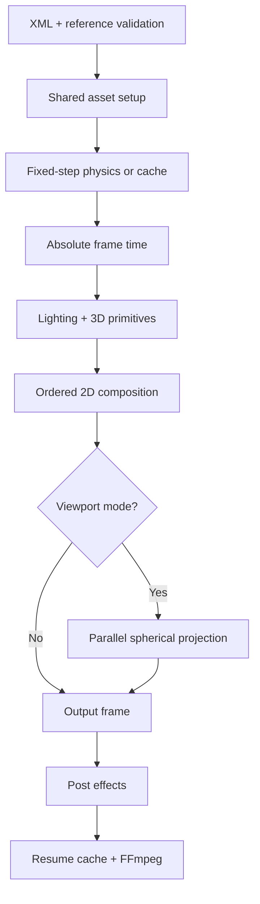

# Architecture

## Design constraints

The application is C17 with a narrow POSIX platform layer. There is no global
mutable engine state: `SrScene`, diagnostics, render options, frames, caches,
and encoder handles have explicit ownership and lifetimes. Dynamically sized
arrays impose no artificial layer limit. Production media codecs remain in
FFmpeg rather than being reimplemented.

## Modules

| Module | Responsibility |
|---|---|
| `common` | checked allocation helpers, parsing, paths, matrices, monotonic clock |
| `diagnostics` | contextual error/warning/info records |
| `timeline` | stable key ordering and six interpolation curves |
| `scene` | owned scene graph and all typed scene resources |
| `xml*` | Expat callbacks, contextual grammar, typed attributes, reference resolution |
| `assets`, `procedural` | shared still cache, lazy video LRU, built-in text/vector rasterization |
| `audio` | FFmpeg decode to disk streams and bounded C mixer |
| `physics` | fixed-step 2D solver, contact/constraint handling, cache serialization |
| `lighting` | CPU lit primitive renderer and approximate shadows |
| `compositor` | hierarchy, masks, deformation, sampling, blend/color equations, particles |
| `camera` | equirectangular viewport mapping and deterministic row workers |
| `effects` | blur, glow/bloom, grade, vignette, and lens-flare approximation |
| `resume` | content-signature directory and atomic raw-frame cache writes |
| `encoder` | supervised FFmpeg pipe, codec selection, A/V muxing, exit handling |
| `renderer` | phase ordering, absolute-frame loop, preview, range, metrics |
| `main` | CLI parsing, overrides, quality policy, CPU fallback |

## Ownership

- `sr_scene_load_xml` initializes and owns every allocation reachable from
  `SrScene`; `sr_scene_free` releases it.
- Layer nodes reference shared `SrAsset` entries. Instances never own decoded
  buffers.
- A still has one cached RGBA image. A video has four LRU entries keyed by
  integer source-frame index.
- Decoded audio and mixed audio are temporary disk streams. Cleanup happens
  after FFmpeg exits, including error paths.
- `SrFrame` owns exactly one RGBA allocation.
- Encoder and resume handles are local to one `sr_render` call.

## Frame execution

Audio is prepared once for the selected frame interval. Video frame zero and
mixed audio sample zero both represent the selected interval start, so FFmpeg
receives synchronized, zero-based streams.

## Timeline and media time

Master frame time is calculated directly from the integer frame index and the
rational project FPS. A layer without `source.time` maps local time through
`speed / timeStretch`, trim, finite play count, and optional reverse. A
`source.time` track is an explicit time-remap and takes precedence. The same
asset may therefore serve multiple independently timed instances.

## Color and blending

Inputs are RGBA in sRGB encoding. The compositor implements straight-alpha
source-over plus normal, add, multiply, screen, overlay, and difference blend
functions. With linear-light mode enabled, RGB operands pass through exact sRGB
transfer functions around the blend. FFmpeg performs final pixel-format and
codec conversion.

## Physics

The solver samples at `fixedStep`, never output FPS. Dynamic bodies receive
gravity, fields, spring forces, damping, integration, three deterministic
contact iterations, and friction/restitution impulses. Static bodies have zero
inverse mass; kinematic bodies follow prescribed velocity. Samples are
linearly interpolated for render time.

The optional cache contains a versioned header, scene/physics signature, body
count, step, and absolute poses. A mismatch causes deterministic resimulation.
This is a visual rigid-body solver, not a verified physically accurate solver.

## 360 and camera

An equirectangular canvas maps longitude to X and latitude to Y. Viewport rays
use vertical FOV and output aspect, then apply roll, pitch, and yaw before
bilinear wrapped sampling. Worker threads own disjoint row intervals and never
reduce shared floating-point values, preserving exact output across thread
counts. Camera translation has no effect for an infinitely distant panorama.

For standard scenes, an active camera applies perspective or orthographic
projection to the built-in 3D primitives. Without a camera, primitive X/Y
coordinates are interpreted as screen coordinates for convenient 2D/3D
composites.

## Streaming, resume, and fallback

Only the current render surfaces are retained. FFmpeg consumes raw RGBA over a
pipe. Audio is mixed in 4096-frame blocks. Resume mode stores each completed
RGBA frame atomically under `OUTPUT.resume/SIGNATURE`; a restarted run still
rebuilds the output container but avoids rerendering cached frames.

Codec/GPU capabilities are not assumed. Missing FFmpeg or encoder failures
return nonzero diagnostics. A GPU request warns and falls back to CPU. Failed
allocations, asset decodes, cache writes, pipes, or child exit statuses are
propagated rather than ignored.
